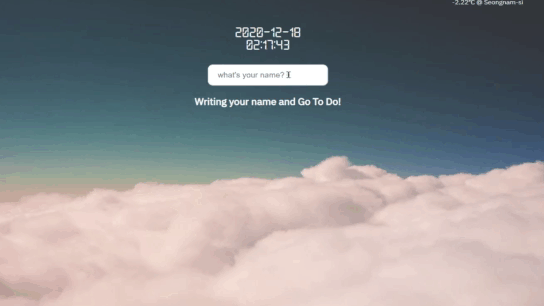

# To Do App

[구경하기](https://chkim116.github.io/ToDoAPP/)

## Reason

#### Why?

일반적인 투두리스트에 날짜 선택을 추가하여 보다 기능적으로 우수한 투두리스트를 구현하고자 했고,  끝마친 투두리스트를 담을 finish 메뉴를 만들어 완료한 투두를 저장해 놓고자 하였습니다.

#### Info

투두앱은 일반적인 투두리스트의 기능은 물론, 시작과 끝의 기한을 설정할 수 있습니다.

사용자가 완료했다고 버튼을 누르게 되면 자동으로 완료 버튼을 누른 해당 날짜와 함께 Finish 메뉴에 담기게 됩니다.

 
 

## Stack

<strong>HTML</strong>

<strong>CSS</strong>

<strong>Vanila Javscript</strong>

 
 

## Structure

-   js

    -   clock - setInterval을 활용한 시간 로직
    -   image - 접속 시마다 랜덤 배경 설정
    -   printUser - 사용자 이름 입력 및 로그인
    -   todolist - 투두리스트 작성
    -   weather - 날씨 출력

     
     

## Features

<ul>
<li><a href="#login">로그인</a></li>
<li><a href="#todo">투두리스트 작성</a></li>
</ul>

 
 

#### <a style="color : black" id="login">로그인</a>

처음 접속 시 유저는 자신이 사용할 닉네임을 설정합니다.

해당 입력은 로컬스토리지에 저장되며, 새로고침 시에도 유지됩니다.

 

 

#### <a style="color : black" id="todo">투두리스트 작성</a>

시작 날짜와 끝 날짜를 임의로 설정할 수 있습니다.
 또는 시작 날짜만 설정할 수 있습니다.

만약 아무것도 설정하지 않는다면, 날짜를 제외하고 저장됩니다.
 사용자가 완료 버튼을 클릭하면 Finish 메뉴에 어떤 목록을 언제 완료했는지 표시됩니다.

해당 입력은 로컬스토리지에 저장되며, 새로고침 시에도 유지됩니다.

 

 
